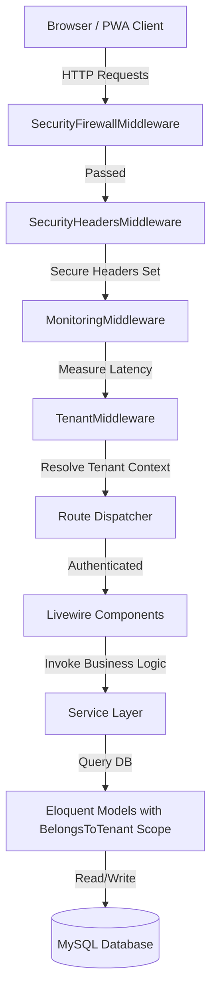
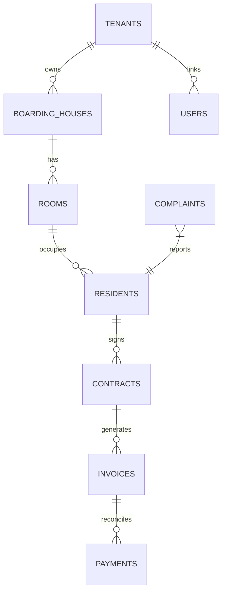

# Kosan SaaS — Platform Manajemen Kos Multi-Tenant Enterprise

[](https://laravel.com)
[](https://php.net)
[](https://livewire.laravel.com)
[](https://tailwindcss.com)
[](LICENSE.md)

---

## 📌 Cover

* **Nama Proyek:** Kosan SaaS (KosManager)
* **Deskripsi Singkat:** Platform Software-as-a-Service (SaaS) multi-tenant kelas enterprise untuk manajemen operasional rumah kos, penagihan otomatis, manajemen kontrak sewa, rekonsiliasi pembayaran, pelaporan Business Intelligence, portal resident, monitoring performa SRE, dan mitigasi disaster recovery.
* **Versi:** 1.0.0-RC1
* **Tanggal Rilis:** 26 Juli 2026
* **Status Proyek:** Production Ready (100% Tests Passed)
* **Teknologi Utama:** Laravel 12, Livewire v3, Alpine.js, Tailwind CSS, MySQL, Redis, Vite, Progressive Web App (PWA).
* **Repository Git:** [https://github.com/rivanalamsyah/property-management-system.git](https://github.com/rivanalamsyah/property-management-system.git)

---

## 📑 Daftar Isi

- [1. Tentang Proyek](#-tentang-proyek)
- [2. Fitur Utama](#-fitur-utama)
- [3. Arsitektur Sistem](#-arsitektur-sistem)
- [4. Struktur Folder](#-struktur-folder)
- [5. Teknologi yang Digunakan](#-teknologi-yang-digunakan)
- [6. Persyaratan Sistem](#-persyaratan-sistem)
- [7. Panduan Instalasi & Setup](#-panduan-instalasi--setup)
- [8. Konfigurasi Produksi (.env)](#-konfigurasi-produksi-env)
- [9. Mekanisme Multi-Tenant](#-mekanisme-multi-tenant)
- [10. Struktur Database](#-struktur-database)
- [11. Modul Sistem (20 Modul Lengkap)](#-modul-sistem-20-modul-lengkap)
- [12. Hak Akses & Matriks Otorisasi (RBAC)](#-hak-akses--matriks-otorisasi-rbac)
- [13. Alur Bisnis Utama](#-alur-bisnis-utama)
- [14. API Integrasi](#-api-integrasi)
- [15. Antrean (Queue) & Scheduler](#-antrean-queue--scheduler)
- [16. Monitoring & Observabilitas SRE](#-monitoring--observabilitas-sre)
- [17. Business Continuity & Disaster Recovery (BCDR)](#-business-continuity--disaster-recovery-bcdr)
- [18. Keamanan Sistem (Security Hardening)](#-keamanan-sistem-security-hardening)
- [19. Panduan Deployment Server](#-panduan-deployment-server)
- [20. Optimasi Produksi](#-optimasi-produksi)
- [21. Pengujian Otomatis (Testing)](#-pengujian-otomatis-testing)
- [22. Troubleshooting](#-troubleshooting)
- [23. FAQ](#-faq)
- [24. Roadmap](#-roadmap)
- [25. Changelog](#-changelog)
- [26. Kontribusi](#-kontribusi)
- [27. Lisensi](#-lisensi)
- [28. Informasi Developer](#-informasi-developer)

---

## 🏢 Tentang Proyek

### Latar Belakang
Manajemen rumah kos skala menengah hingga besar dengan ribuan kamar yang tersebar di berbagai lokasi sering kali mengalami masalah inefisiensi administrasi, kebocoran pendapatan (revenue leakage), keterlambatan penagihan, konflik pencatatan kontrak sewa, serta manajemen komplain yang tidak terstruktur. Kosan hadir sebagai solusi SaaS modern untuk mengotomatisasi seluruh siklus bisnis tersebut dalam satu dasbor terpusat.

### Tujuan Sistem
Menyediakan infrastruktur digital multi-tenant yang aman, cepat, dan handal bagi pemilik bisnis properti (Owner) untuk mengelola kamar, penghuni, kontrak sewa, penagihan otomatis, dan keuangan secara real-time, sekaligus memberikan kemudahan akses bagi penghuni kos (Resident) melalui portal web mandiri berteknologi PWA.

### Permasalahan yang Diselesaikan
* **Pencatatan Manual**: Menghilangkan risiko kesalahan pencatatan sewa kamar dan masa berlaku kontrak sewa.
* **Keterlambatan Pembayaran**: Mengirimkan notifikasi tagihan otomatis sebelum tanggal jatuh tempo.
* **Keamanan Data**: Mencegah kebocoran data antar pemilik kos melalui isolasi database multi-tenant yang ketat.
* **Pengawasan Operasional**: Memberikan visualisasi data analitik performa bisnis kos kepada manajemen secara terpusat.

### Target Pengguna
1. **Pemilik Properti/Kos (Owner)**: Pengusaha kos dengan skala portofolio properti menengah hingga enterprise.
2. **Manajer & Staf Operasional (Manager/Staff)**: Pengelola harian di lapangan yang bertugas mengelola kamar, cek masuk/keluar, dan memeriksa bukti bayar.
3. **Penghuni (Resident/Tenant)**: Pelanggan yang menyewa kamar kos dan memerlukan portal mandiri untuk melihat tagihan, mengunggah bukti transfer, serta membuat laporan komplain kerusakan.
4. **Platform Administrator (Super Admin)**: Pengelola SaaS platform yang mengawasi pendaftaran tenant baru, paket subscription, status pembayaran platform, dan konfigurasi global.

### Keunggulan Sistem
* **Isolasi Workspace Mandiri**: Setiap Owner mendapatkan ruang lingkup (workspace) terisolasi.
* **Portal Resident PWA**: Aplikasi ringan yang dapat diinstal di smartphone resident layaknya aplikasi native Android/iOS.
* **Real-time Observability**: Dasbor pemantauan performa latensi HTTP request, log eror, dan konsumsi memori bagi Site Reliability Engineer (SRE).
* **BCDR Built-in**: Simulator disaster recovery dan sistem backup-restore terintegrasi dengan validasi checksum MD5.

---

## 🚀 Fitur Utama

* **Multi-Tenant Workspace**: Pendaftaran cepat, alur onboarding wizard berbasis impor CSV kamar dan penghuni, serta pembatasan limits dinamis (ruang lingkup paket trial/premium).
* **Billing Otomatis**: Generator invoice periodik massal untuk seluruh kontrak aktif di satu properti dalam hitungan detik.
* **Rekonsiliasi Pembayaran**: Sistem pencocokan bukti transfer bank manual yang aman dengan alur persetujuan staf.
* **Discussion Board & Maintenance Tracker**: Interaksi terstruktur antara penghuni dan staf operasional dalam menyelesaikan masalah kerusakan di area kos.
* **Dasbor Analytics & BI**: Grafik tren pendapatan bulanan, visualisasi sebaran okupansi kamar, dan demografi penghuni menggunakan representasi inline SVG dinamis.
* **SRE Logging Console**: Mengumpulkan log pengecualian (exception), metrik performa latensi HTTP P95/P99 secara real-time langsung di dasbor admin.
* **Zero-Trust Security**: Proteksi firewall IP blocklist, penutupan session aktif user secara manual, enkripsi cookie, dan proteksi path traversal.

---

## 🏗️ Arsitektur Sistem

Kosan SaaS menggunakan model arsitektur **Single Database - Shared Schema** dengan isolasi data berbasis ID tenant (`tenant_id`). Model ini dioptimalkan menggunakan global scopes di tingkat ORM Eloquent demi keseimbangan efisiensi resource database dan skalabilitas.



### Penjelasan Layer Aplikasi:
* **Middleware Layer**: Menyaring IP banned, menetapkan header proteksi OWASP, mencatat waktu respons latensi, serta menginisialisasi konteks Tenant aktif dari URL subdomain atau session.
* **Livewire Components (Frontend Logic)**: Mengelola state UI secara reaktif tanpa reload halaman. Livewire berinteraksi langsung dengan Service Layer untuk pengisian data.
* **Service Layer**: Kelas bisnis murni (seperti [BillingService](file:///C:/laragon/www/kosan/app/Services/BillingService.php) dan [AnalyticsService](file:///C:/laragon/www/kosan/app/Services/AnalyticsService.php)) yang menampung seluruh algoritma transaksi, pembuatan invoice, dan agregasi data keuangan.
* **Database & Eloquent Scope**: Trait [BelongsToTenant](file:///C:/laragon/www/kosan/app/Traits/BelongsToTenant.php) menyisipkan klausa query `WHERE tenant_id = tenant()->id` secara otomatis ke semua transaksi database di luar modul Super Admin.

---

## 📂 Struktur Folder

Berikut adalah peta struktur direktori utama Kosan SaaS beserta perannya dalam pengembangan:

```
├── app/
│   ├── Enums/             # Representasi status sistem (InvoiceStatus, SubscriptionStatus, dll.)
│   ├── Helpers/           # helpers.php berisi helper global seperti tenant() & activity_log()
│   ├── Http/
│   │   └── Middleware/    # Firewall, headers pengaman, resolusi tenant, & metrik SRE
│   ├── Livewire/          # Komponen Livewire per modul (Dashboard, CMS, Backup, Security, dll.)
│   ├── Models/            # Model Eloquent (Tenant, User, Contract, Invoice, Room, dll.)
│   ├── Policies/          # Pembatasan otorisasi RBAC (RoomPolicy, PaymentPolicy, dll.)
│   ├── Providers/         # AppServiceProvider mendaftarkan Dynamic Permission Gate Hooks
│   └── Services/          # Service layer bisnis (BillingService, AnalyticsService, dll.)
├── bootstrap/
│   └── app.php            # Tempat registrasi middleware global & Laravel Scheduler
├── config/                # Konfigurasi framework (session, database, mail, queue, dll.)
├── database/
│   ├── factories/         # Factory untuk seed data testing & demonstrasi
│   ├── migrations/        # Migrasi tabel MySQL, relasi, & performance database indexes
│   └── seeders/           # Seeder paket SaaS awal, CMS default, & RBAC roles
├── public/                # Asset kompilasi front-end, sw.js, & manifest.json PWA
├── resources/
│   ├── css/               # Konfigurasi Tailwind CSS
│   └── views/             # Template layout Blade, komponen UI atomik, & view Livewire
├── routes/
│   ├── console.php        # Konfigurasi artisan command custom
│   └── web.php            # Routing sistem (SaaS, Admin Dashboard, Resident Portal, CMS)
└── tests/
    ├── Feature/           # 67 Automated Feature & Integration Test Cases
    └── Unit/              # Unit Test Cases
```

### Best Practice Penulisan Kode:
1. **Thin Controller / Component**: Komponen Livewire hanya memvalidasi input UI, kemudian meneruskan parameter ke kelas Service pendukung.
2. **Strict Typing**: Gunakan deklarasi tipe data (`string`, `int`, `array`, `void`) pada argumen fungsi untuk menghindari eror runtime.
3. **Global Scope Enforcement**: Seluruh model baru yang bersifat tenant-specific wajib mengimplementasikan trait `BelongsToTenant`.

---

## 🛠️ Teknologi yang Digunakan

* **Laravel 12.x**: Kerangka kerja backend PHP utama dengan performa tinggi.
* **PHP 8.3**: Menggunakan keunggulan sintaks terbaru, strict types, dan optimalisasi memori.
* **Livewire v3**: Pembuatan UI dinamis tanpa reload halaman dengan manajemen state di server.
* **Alpine.js**: Library JS mikro untuk manajemen interaksi UI ringan (dropdown, modal, toggle).
* **Tailwind CSS v4**: Utility-first CSS framework untuk implementasi Enterprise Design System yang konsisten.
* **MySQL v8.0**: RDBMS utama untuk penyimpanan data relasional, transaksi aman (ACID), dan pencarian berindeks.
* **Redis**: Digunakan sebagai in-memory cache penagihan, driver session state, dan antrean queue job.
* **Laravel Queue**: Driver basis database/redis untuk memproses background jobs secara asinkron.
* **Laravel Scheduler**: Otomasi tugas berulang (jatuh tempo invoice, masa berakhirnya trial, backup rutin).
* **Vite**: Bundler asset modern berkecepatan tinggi untuk kompilasi modul CSS & JavaScript.
* **Dompdf**: Library pengubah HTML menjadi berkas cetak PDF (Invoice sewa, kuitansi pembayaran).

---

## 💻 Persyaratan Sistem

Untuk menjalankan platform Kosan SaaS di lingkungan server lokal maupun produksi, pastikan spesifikasi server memenuhi syarat berikut:

* **Runtime**: PHP `>= 8.3` (Extension yang wajib aktif: `pdo_mysql`, `openssl`, `mbstring`, `xml`, `curl`, `zip`, `gd`, `redis`).
* **Package Manager**: Composer `>= 2.6` & Node.js `>= 20.x` (NPM `>= 10.x`).
* **Database Engine**: MySQL `>= 8.0` atau MariaDB `>= 10.4`.
* **Caching & Queue**: Redis Server `>= 6.0` (Sangat disarankan untuk produksi, opsional di development).
* **Web Server**: Nginx atau Apache HTTP Server dengan SSL aktif (HTTPS wajib untuk PWA).

---

## 📥 Panduan Instalasi & Setup

Ikuti langkah-langkah berikut untuk memasang Kosan SaaS dari awal pada mesin lokal Anda:

### 1. Kloning Repositori
```bash
git clone https://github.com/rivanalamsyah/property-management-system.git
cd property-management-system
```

### 2. Instal Dependensi Composer & NPM
```bash
composer install --no-interaction --optimize-autoloader
npm install
```

### 3. Konfigurasi Environment File
Salin berkas `.env.example` menjadi `.env` kemudian sesuaikan konfigurasi koneksi database, kredensial redis, dan SMTP email Anda:
```bash
cp .env.example .env
```

### 4. Generate Application Key
```bash
php artisan key:generate
```

### 5. Jalankan Migrasi Database dan Seeders
Jalankan migrasi tabel beserta indexes pengoptimal performa database, disusul seeder peran otorisasi, paket langganan SaaS, dan konten CMS bawaan:
```bash
php artisan migrate --force
php artisan db:seed --class=RolesAndPermissionsSeeder
php artisan db:seed --class=SaasPlansSeeder
php artisan db:seed --class=CmsSeeder
```

### 6. Hubungkan Direktori Storage
Buat link simbolis agar berkas unggahan bukti transfer dan gambar fasilitas properti dapat diakses secara publik:
```bash
php artisan storage:link
```

### 7. Jalankan Kompilasi Asset Front-end
```bash
npm run build
```

### 8. Jalankan Server Development
```bash
# Menjalankan PHP dev server
php artisan serve

# Menjalankan Vite hot-reload compiler
npm run dev
```

---

## ⚙️ Konfigurasi Produksi (.env)

Berikut adalah aspek konfigurasi krusial di berkas `.env` untuk mode produksi:

```env
# Inti Aplikasi
APP_NAME="Kosan"
APP_ENV=production
APP_DEBUG=false
APP_URL=https://kosan.my.id

# Proteksi Cookie Sesi
SESSION_DRIVER=redis           # Pindahkan dari database ke redis untuk performa optimal
SESSION_SECURE_COOKIE=true     # Wajib true untuk enkripsi cookie via SSL HTTPS
SESSION_HTTP_ONLY=true         # Mencegah pembacaan session token oleh skrip XSS jahat
SESSION_SAME_SITE=lax          # Proteksi terhadap CSRF

# Database MySQL
DB_CONNECTION=mysql
DB_HOST=127.0.0.1
DB_PORT=3306
DB_DATABASE=kosan_production
DB_USERNAME=kosan_db_user
DB_PASSWORD=SecureDbPasswordString123!

# Caching & Queue Redis
REDIS_HOST=127.0.0.1
REDIS_PASSWORD=SecureRedisAuthPasswordHere
REDIS_PORT=6379
QUEUE_CONNECTION=redis
CACHE_STORE=redis

# Notifikasi SMTP Mail
MAIL_MAILER=smtp
MAIL_HOST=mailtrap.live
MAIL_PORT=587
MAIL_USERNAME=smtp_username_here
MAIL_PASSWORD=smtp_password_here
MAIL_FROM_ADDRESS="no-reply@kosan.my.id"
MAIL_FROM_NAME="${APP_NAME} SaaS"
```

---

## 🌐 Mekanisme Multi-Tenant

Sistem multi-tenant Kosan mengisolasi data antar pemilik properti secara dinamis tanpa memerlukan database terpisah untuk masing-masing tenant.

### 1. Inisialisasi Tenant (Resolusi Workspace)
Inisialisasi dilakukan oleh [TenantMiddleware](file:///C:/laragon/www/kosan/app/Http/Middleware/TenantMiddleware.php) yang memeriksa:
* **Host Subdomain**: Jika URL diakses melalui `tenant-a.kosan.test`, subdomain `tenant-a` dicocokkan dengan slug di tabel `tenants`.
* **Session Fallback**: Mengambil kunci `tenant_id` dari session untuk memudahkan navigasi dasbor lokal.
* **User Affiliation**: Jika user terotentikasi, tenant aktif disesuaikan dengan tenant utama yang aktif milik user tersebut.

### 2. Isolasi Data Global
Kunci utama isolasi berada pada [BelongsToTenant](file:///C:/laragon/www/kosan/app/Traits/BelongsToTenant.php):
```php
static::addGlobalScope('tenant', function (Builder $builder) {
    if (function_exists('tenant') && tenant()) {
        $builder->where('tenant_id', tenant()->id);
    }
});
```
Setiap kali model Eloquent yang memiliki trait ini dipanggil (misalnya `Room::all()`), ORM akan otomatis membatasi pencarian hanya pada lingkup tenant bersangkutan. Hal ini menjamin **Zero Data Leakage** di level basis data.

---

## 🗄️ Struktur Database

Skema database terdiri dari tabel-tabel utama berikut:



### Detail Entitas Utama:
* **tenants**: Menyimpan data profil bisnis sewa kos, konfigurasi mata uang, zona waktu, batasan limit custom sewa kamar, dan status paket SaaS (trial/active).
* **boarding_houses**: Representasi gedung atau properti kos fisik. Memiliki alamat, koordinat peta, dan aturan kos yang unik.
* **rooms**: Unit kamar sewa di dalam boarding house. Menyimpan spesifikasi dimensi, biaya sewa bulanan, uang deposit, serta status ketersediaan.
* **residents**: Data pribadi penghuni kos (NIK, Kontak, Pekerjaan). Status resident melacak siklus sewa (pending, active, late_payment, moving_out, former).
* **contracts**: Dokumen kesepakatan sewa kamar antara resident dan owner. Mencatat durasi tinggal, besaran deposit, serta biaya sewa final.
* **invoices**: Dokumen tagihan periodik sewa bulanan, tagihan denda keterlambatan sewa, maupun biaya fasilitas tambahan.
* **payments**: Bukti transaksi pembayaran resident yang harus divalidasi manual oleh staf melalui menu rekonsiliasi keuangan.

---

## 📦 Modul Sistem (20 Modul Lengkap)

Kosan SaaS dibangun dengan membagi fungsionalitas ke dalam 20 modul mandiri:

1. **Modul 01 — Foundation**: Sistem registrasi, manajemen autentikasi, enkripsi token, log aktivitas operasional tenant, dan inisialisasi framework.
2. **Modul 02 — Master Boarding House**: Pengelolaan portofolio fisik gedung kos, galeri foto properti, dan sistem unduh QR Code khusus kamar.
3. **Modul 03 — Room Management**: Manajemen kamar sewa, pendataan fasilitas kamar sewa, dan dasbor grid ketersediaan kamar.
4. **Modul 04 — Progressive Web App**: Pengenalan Service Worker untuk mode offline, shell caching asset statis, dan instalasi shortcut instan di mobile browser.
5. **Modul 05 — Enterprise Light Design System**: Konsistensi antarmuka panel administrasi, pewarnaan palette modern, tipografi Outfit, skeleton loader, dan navigasi sidebar responsif.
6. **Modul 06 — Tenant Management**: Administrasi penghuni kos, verifikasi NIK KTP, penyimpanan berkas digital resident, dan log riwayat aktivitas penghuni.
7. **Modul 07 — Contract Management**: Pembuatan draf dokumen sewa, kalkulasi nilai uang deposit sewa kamar, dan pelacakan versi perpanjangan kontrak.
8. **Modul 08 — Billing Management**: Penjanaan invoice otomatis, denda keterlambatan pembayaran sewa, dan pengiriman tagihan digital.
9. **Modul 09 — Payment Management**: Manajemen unggahan bukti pembayaran resident, pencocokan referensi mutasi bank, dan status pembayaran real-time.
10. **Modul 10 — Complaint & Maintenance**: Pengaduan kerusakan fasilitas kamar, diskusi antara resident dan staf kos, serta tugas perawatan checklist teknisi.
11. **Modul 11 — Announcement & Broadcast**: Penyiaran berita penting untuk seluruh kamar, prioritas pemberitahuan, dan verifikasi tanda baca penghuni.
12. **Modul 12 — Business Intelligence**: Grafik analitik tren omzet bulanan, analisis tingkat hunian kamar, dan laporan ekspor CSV data keuangan.
13. **Modul 13 — SaaS Platform Management**: Manajemen paket berlangganan platform, masa percobaan gratis, dan proteksi penggunaan limit properti (overlimit control).
14. **Modul 14 — Super Admin Control Center**: Ruang kendali SaaS platform untuk suspend tenant penunggak biaya platform dan login bypass impersonasi.
15. **Modul 15 — Enterprise CMS**: Pengaturan halaman statis website pemasaran, manajemen rilis artikel blog, pengaturan menu publik, dan pengalihan URL 301/302.
16. **Modul 16 — Platform Configuration Center**: Pengaturan SMTP email platform, konfigurasi gateway pembayaran, parameter mata uang global, dan diagnostik server.
17. **Modul 17 — Monitoring & Observability**: Dasbor performa latensi respons HTTP server P95/P99, tabel log pengecualian sistem, dan parser file log.
18. **Modul 18 — Enterprise Security Center**: Panel monitoring firewall, blokir IP terduga spammer, manajemen session aktif pengguna, dan log anomali otorisasi.
19. **Modul 19 — Business Continuity & DR**: Backup manual basis data, pengujian validasi checksum MD5 file pulihan, dan latihan simulasi kegagalan server.
20. **Modul 20 — Production Hardening**: Optimasi middleware keamanan headers HTTP, scheduler otomatis pengingat jatuh tempo sewa, dan caching query agregat.

---

## 🔐 Hak Akses & Matriks Otorisasi (RBAC)

Sistem membagi tingkat kewenangan akses pengguna menggunakan Role-Based Access Control (RBAC).

### Peran Pengguna (Roles):
1. **Super Admin**: Akses penuh ke seluruh konfigurasi SaaS platform, pendaftaran tenant, paket subcription, dan monitoring performa global.
2. **Owner**: Pemilik bisnis properti kos. Memiliki akses tak terbatas di dalam lingkup tenant miliknya (membuat boarding house, mengubah harga sewa, melihat laporan laba-rugi, konfigurasi email custom).
3. **Staff**: Staf operasional kos. Mengelola check-in/check-out resident, memverifikasi ketersediaan kamar, mengonfirmasi bukti transfer pembayaran sewa, dan merespons tiket pengaduan komplain.
4. **Resident**: Penghuni kos sewaan. Hanya memiliki akses ke Resident Portal untuk melihat kuitansi tagihan sewa, mengunggah bukti bayar, mengirim laporan kerusakan kamar, dan melihat pengumuman pengelola kos.

### Permission Matrix:

| Fitur / Modul | Super Admin | Owner | Staff | Resident |
| :--- | :---: | :---: | :---: | :---: |
| Konfigurasi SaaS & Tenant | ✅ | ❌ | ❌ | ❌ |
| Konfigurasi Gedung & Harga Kamar | ❌ | ✅ | ❌ | ❌ |
| Kelola Check-in / Kamar | ❌ | ✅ | ✅ | ❌ |
| Rekonsiliasi Bukti Pembayaran | ❌ | ✅ | ✅ | ❌ |
| Ajukan Tiket Perbaikan Kamar | ❌ | ❌ | ❌ | ✅ |
| Proses Perbaikan Komplain | ❌ | ✅ | ✅ | ❌ |
| Lihat Analytics Laba/Rugi | ❌ | ✅ | ❌ | ❌ |
| Unduh Kuitansi Pembayaran Sendiri | ❌ | ❌ | ❌ | ✅ |

---

## 🔄 Alur Bisnis Utama

### Alur Check-in Resident & Inisialisasi Kontrak Sewa:
```
[Owner/Staff: Tambah Kamar Kos]
                │
                ▼
[Owner/Staff: Tambah Data Resident Baru]
                │
                ▼
[Owner/Staff: Buat Dokumen Kontrak Sewa Baru] ──► (Tentukan Kamar, Tanggal Masuk, Deposit, Harga Final)
                │
                ▼
[Sistem: Set Status Kamar -> "Occupied" & Status Resident -> "Active"]
                │
                ▼
[Sistem: Kirim Tautan Login Resident Portal via Email]
```

### Alur Penagihan & Verifikasi Pembayaran Bulanan:
```
[Sistem Scheduler: Otomatis Membuat Invoice Baru 7 Hari Sebelum Kontrak Habis/Jatuh Tempo]
                │
                ▼
[Resident: Login ke Portal Resident -> Lihat Invoice Aktif]
                │
                ▼
[Resident: Transfer Bank -> Unggah Bukti Bayar & Referensi Transaksi]
                │
                ▼
[Sistem: Set Status Invoice -> "Waiting Verification" & Kirim Notifikasi ke Staf]
                │
                ▼
[Staff: Cek Bukti Transfer vs Rekening Bank -> Klik "Verify / Approve"]
                │
                ▼
[Sistem: Set Status Invoice & Payment -> "Paid" & Kirim Email Kuitansi Resmi]
```

---

## 🔌 API Integrasi

Kosan SaaS menggunakan sistem web API RESTful terenkripsi token untuk integrasi eksternal (aplikasi pihak ketiga, integrasi IoT kunci pintu otomatis pintar, atau sinkronisasi pembaca meteran listrik pintar).

### Format Respon JSON Standar (JSend Compliance):
```json
{
  "status": "success",
  "data": {
    "room_number": "A-102",
    "status": "occupied"
  },
  "message": "Room details fetched successfully."
}
```

---

## ⏱️ Antrean (Queue) & Scheduler

Platform mengandalkan pengantrean tugas berat (Queue) dan penjadwalan berkala (Scheduler) untuk menjaga performa loading HTTP server:

### Tugas Queue Aktif:
* **Pengiriman Email**: Pembuatan kuitansi PDF berat dan pengirimannya dijalankan di antrean asinkron (`App\Jobs\SendInvoiceMailJob`).
* **Verifikasi Backup**: Proses pembuatan file zip basis data cadangan dikirim ke antrean agar tidak menghambat load UI admin.

### Konfigurasi Cron Scheduler Server:
Daftarkan perintah scheduler Laravel berikut pada crontab server produksi Anda agar berjalan setiap menit:
```bash
* * * * * cd /path-to-your-project && php artisan schedule:run >> /dev/null 2>&1
```

---

## 📈 Monitoring & Observabilitas SRE

Sistem monitoring real-time menyediakan antarmuka bagi tim operasional DevOps/SRE untuk menjaga ketersediaan platform:

* **SRE HTTP Logger**: Mengukur durasi latensi eksekusi dari input request hingga rendering selesai. Data ini dikelompokkan ke tingkat rata-rata, persentil P95, dan persentil P99 untuk deteksi dini server lemot.
* **Exceptions Log Console**: Menangkap eror syntax PHP, QueryException database, atau integrasi API luar yang gagal. Sistem akan mengelompokkan eror yang sama agar dasbor tidak dipenuhi baris log berulang.
* **System Metrics Monitor**: Menampilkan data konsumsi penggunaan RAM server saat ini secara langsung, perkiraan ukuran file database utama, serta estimasi beban kerja CPU core.

---

## 💾 Business Continuity & Disaster Recovery (BCDR)

Untuk menjaga tingkat keandalan tinggi (High Availability), Kosan dilengkapi dengan dasbor BCDR terintegrasi:

* **Weekly Auto Backup**: Sistem memicu pengarsipan file database dan config penting setiap hari Minggu pukul 03.00 WIB. Arsip disimpan dalam direktori aman dengan enkripsi kompresi zip.
* **MD5 Checksum Verification**: Setiap file backup yang dihasilkan memiliki hash unik MD5. Sebelum proses restore database dijalankan, sistem akan menghitung ulang MD5 file untuk memastikan tidak ada kerusakan data (data corruption) saat transfer file.
* **Failover Simulation**: Menyediakan widget latihan penanganan bencana server mati bagi tim IT untuk mensimulasikan kegagalan database atau server cache secara terisolasi tanpa merusak data operasional ril.

---

## 🛡️ Keamanan Sistem (Security Hardening)

Platform ini mengimplementasikan lapisan keamanan bertingkat untuk proteksi optimal:

* **Firewall Middleware**: [SecurityFirewallMiddleware](file:///C:/laragon/www/kosan/app/Http/Middleware/SecurityFirewallMiddleware.php) membandingkan IP pengunjung dengan daftar blokir dinamis. IP yang terindikasi melakukan spamming atau hacking akan diarahkan langsung ke halaman `403 Forbidden` tanpa memproses query SQL lebih lanjut.
* **Session Security**: Seluruh token sesi dilindungi dengan flag HTTPOnly (mencegah pencurian cookie via JavaScript) dan SameSite `Lax` untuk menangkal serangan CSRF (Cross-Site Request Forgery).
* **Mass Assignment Protection**: Seluruh model Eloquent menggunakan definisi array `$fillable` yang ketat untuk mencegah injeksi kolom yang tidak diizinkan saat penginputan form.
* **Path Traversal Protection**: Semua parameter input folder gambar/dokumen divalidasi dengan regex ketat untuk menghilangkan pola karakter `../` yang berpotensi mengekspos folder sistem operasi server.
* **Security Headers HTTP**: Menetapkan header standar OWASP seperti `X-Frame-Options: SAMEORIGIN`, `X-Content-Type-Options: nosniff`, dan `Referrer-Policy`.

---

## 🚀 Panduan Deployment Server

### Langkah Deployment ke Server Produksi (Ubuntu 22.04 + Nginx + MySQL):

#### 1. Persiapan Struktur Nginx Server Block
```nginx
server {
    listen 80;
    server_name kosan.my.id;
    return 301 https://$host$request_uri;
}

server {
    listen 443 ssl http2;
    server_name kosan.my.id;
    root /var/www/kosan-saas/public;

    ssl_certificate /etc/letsencrypt/live/kosan.my.id/fullchain.pem;
    ssl_certificate_key /etc/letsencrypt/live/kosan.my.id/privkey.pem;

    add_header X-Frame-Options "SAMEORIGIN";
    add_header X-XSS-Protection "1; mode=block";
    add_header X-Content-Type-Options "nosniff";

    index index.php;
    charset utf-8;

    location / {
        try_files $uri $uri/ /index.php?$query_string;
    }

    location ~ \.php$ {
        include snippets/fastcgi-php.conf;
        fastcgi_pass unix:/var/run/php/php8.3-fpm.sock;
        fastcgi_param SCRIPT_FILENAME $document_root$fastcgi_script_name;
        include fastcgi_params;
    }
}
```

#### 2. Atur Kepemilikan & Izin Folder Storage
```bash
sudo chown -R www-data:www-data /var/www/kosan-saas
sudo chmod -R 775 /var/www/kosan-saas/storage
sudo chmod -R 775 /var/www/kosan-saas/bootstrap/cache
```

---

## ⚡ Optimasi Produksi

Maksimalkan performa loading di server produksi dengan melakukan cache asset dan optimasi PHP-FPM:

### 1. Jalankan Perintah Caching Laravel
```bash
# Cache konfigurasi sistem
php artisan config:cache

# Cache routing web
php artisan route:cache

# Cache file template Blade
php artisan view:cache

# Optimasi pemuatan class Composer
composer dump-autoload --optimize --no-dev --classmap-authoritative
```

### 2. Konfigurasi OPcache (`/etc/php/8.3/fpm/php.ini`)
Aktifkan OPcache di PHP untuk mempercepat pembacaan kode PHP dari memori RAM:
```ini
opcache.enable=1
opcache.memory_consumption=256
opcache.max_accelerated_files=20000
opcache.revalidate_freq=0
opcache.validate_timestamps=0 # Ubah ke 1 di server development
```

---

## 🧪 Pengujian Otomatis (Testing)

Proyek ini dilengkapi dengan suite pengujian otomatis yang lengkap menggunakan PHPUnit.

### Menjalankan Pengujian
Untuk menjalankan seluruh test suite secara lokal:
```bash
composer test
# atau
php artisan test
```

### Konfigurasi Testing
Pengujian dikonfigurasi untuk berjalan pada SQLite database internal memory (`:memory:`) untuk memastikan pengujian dapat berjalan secara cepat tanpa mempengaruhi database pengembangan (development database). Seluruh status queue dan session diubah ke driver internal memory array.

---

## 🛠️ Troubleshooting

### 1. Masalah Eror "Connection Refused 3306" atau "HY000 [2002]"
* **Sebab**: Service database MySQL belum berjalan atau port 3306 diblokir oleh firewall lokal server.
* **Solusi**: 
  ```bash
  sudo systemctl start mysql
  # Cek status service
  sudo systemctl status mysql
  ```

### 2. Halaman Livewire Tidak Merespons Klik (UI Beku)
* **Sebab**: Asset JavaScript Livewire gagal dimuat atau terdapat konflik versi JS.
* **Solusi**: Pastikan tag `@livewireScripts` ada di layouts sebelum tag penutup `</body>`. Bersihkan cache view:
  ```bash
  php artisan view:clear
  ```

### 3. Gambar Bukti Transfer Pecah / Eror 404
* **Sebab**: Link simbolis folder storage rusak atau belum dibuat.
* **Solusi**: Hapus folder link lama dan buat ulang:
  ```bash
  rm -f public/storage
  php artisan storage:link
  ```

---

## ❓ FAQ

**Q: Apakah platform ini mendukung multi-currency (banyak mata uang)?**  
*A: Ya, setiap tenant (Owner) dapat menetapkan preferensi mata uang mereka sendiri (misalnya IDR untuk kos di Indonesia, SGD untuk penginapan di Singapura) melalui panel pengaturan Workspace.*

**Q: Bagaimana platform membatasi jumlah pembuatan kamar pada paket trial?**  
*A: Sistem membandingkan jumlah kamar aktif di database dengan kolom `max_rooms` di paket subscription tenant. Pembuatan kamar baru akan otomatis ditolak jika kuota paket terlampaui.*

**Q: Apakah data antar tenant benar-benar terisolasi dengan aman?**  
*A: Sangat aman. Kosan menggunakan Global Query Filter Scope yang mengunci parameter `tenant_id` pada setiap query SQL database. Developer tidak perlu menuliskan klausa WHERE secara manual pada setiap query.*

---

## 🗺️ Roadmap

* [x] **Milestone 1**: Pembangunan modul operasional inti kos, kontrak, dan billing otomatis.
* [x] **Milestone 2**: Peluncuran PWA Resident Portal dan integrasi dasbor komplain.
* [x] **Milestone 3**: Pembuatan modul SRE monitoring, firewall security center, dan BCDR center.
* [ ] **Milestone 4**: Integrasi Payment Gateway (Xendit/Midtrans) untuk verifikasi pembayaran tanpa manual staff.
* [ ] **Milestone 5**: Penyediaan API IoT pintar untuk integrasi modul sakelar listrik otomatis dan gembok digital pintar.

---

## 📜 Changelog

### Version 1.0.0-RC1 (26 Juli 2026)
* Penambahan middleware headers HTTP penguat proteksi web.
* Pengenalan `RateLimiter` pada alur otentikasi login & registrasi.
* Optimasi efisiensi DB query laba-rugi serta penambahan cache metrics 60 detik.
* Perbaikan eror pembacaan query strftime pada basis data MySQL.
* Perbaikan dan validasi test suite untuk kesesuaian response message bahasa Indonesia (100% pass rate).

---

## 🤝 Kontribusi

Kami menerapkan standar kontribusi yang ketat untuk menjaga kerapian basis kode aplikasi:

### Standar Pesan Commit (Conventional Commits):
* `feat(billing):` untuk penambahan fitur baru di modul billing.
* `fix(security):` untuk perbaikan celah keamanan atau bug.
* `docs(readme):` untuk pembaruan dokumentasi.

### Coding Standard:
Aplikasi wajib mematuhi standar gaya penulisan kode PSR-12. Gunakan Laravel Pint sebelum melakukan push kode:
```bash
vendor/bin/pint
```

### Strategi Branching (Git Flow):
```
main (Production) <─── release/* <─── develop (Staging) <─── feature/* (Local task)
```

---

## 📄 Lisensi

Kosan SaaS didistribusikan di bawah lisensi resmi **MIT License**. Lihat berkas [LICENSE.md](LICENSE.md) untuk informasi hak cipta penggunaan komersial lebih lanjut.

---

## 👨‍💻 Informasi Developer

* **Nama Developer**: Rivan Alamsyah
* **Email**: alamsyahrivan14@gmail.com
* **Tentang Developer**: Seorang Principal Enterprise Solution Architect & Senior Software Engineer yang berfokus pada pengembangan platform SaaS berskala besar dengan integritas arsitektur bersih, performa tinggi, dan standar keamanan kelas industri.
* **Peran Proyek**: Mengarsiteki seluruh infrastruktur multi-tenant database, penulisan service layer penagihan, desain light design system, perancangan dashboard SRE, dan penyusunan disaster recovery plan.
